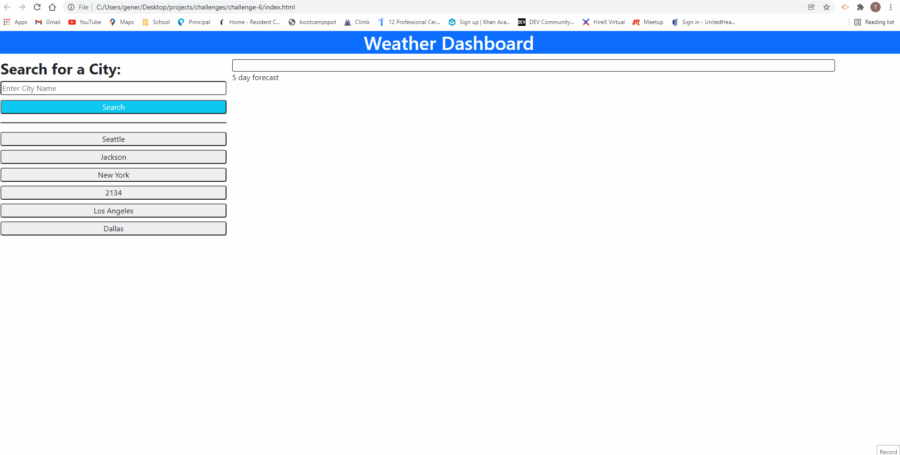

# ch6-Weather-Dashboard
 

## **Link** to web application: https://alinz07.github.io/challenge-6/ 

## **Link** to project repository: https://github.com/alinz07/challenge-6 
 

## **Purpose**
To build a weather dashboard that will run in the browser and feature dynamically updated HTML and CSS.

 

## **Challenge Criteria**
AS A traveler
I WANT to see the weather outlook for multiple cities
SO THAT I can plan a trip accordingly

GIVEN a weather dashboard with form inputs 

* WHEN I search for a city 
THEN I am presented with current and future conditions for that city and that city is added to the search history

* WHEN I view current weather conditions for that city 
THEN I am presented with the city name, the date, an icon representation of weather conditions, the temperature, the humidity, the wind speed, and the UV index

* WHEN I view the UV index 
THEN I am presented with a color that indicates whether the conditions are favorable, moderate, or severe

* WHEN I view future weather conditions for that city 
THEN I am presented with a 5-day forecast that displays the date, an icon representation of weather conditions, the temperature, the wind speed, and the humidity

* WHEN I click on a city in the search history 
THEN I am again presented with current and future conditions for that city

 

## **How and Why**
Pseudo coding really helped me with this one, but I still ended up breaking the DRY principle because I'm short on time and needed to copy the getLongLat function into the HistGetLongLat, instead of passing one into the other. It's more lines of code that would be cleaned up as time allows, but it saved me a lot of time pseudo coding and copying bits of work I had already done.

Working on one section at a time, using console.log statements and copy Request URLs from the Network tab of the console helped me make significant leaps with this one. The only section that is hard coded is the search form. Everything else is dynamically created, emptied, and/or saved to localStorage. The dynamism makes for fast and easy to understand code because it details the elements you're creating and why in both the pseudo code and actual code itself.

 
 

## **Things I learned**
* At the recommendation of my tutor, I put together an MVP before messing with the CSS too much. It really worked. I learned the value of doing the minimum amount of work necessary while juggling multiple projects. Right now we have a group project
I'm working on where we are short-handed, as well as this assignment, and it feels amazing to have an MVP done early, even if it isn't pretty yet.

* I learned a lot about css api's, specifically bootstrap and the rules for it's classes and the html containers necessary to incorporate it. The documentation is extensive and I will work up until the buzzer attempting to match the mock up.

* I spent a lot of time getting the icons to work, which forced me to really analyze the JSON data. I didn't realize that it was a combination of objects and arrays. I needed to index arrays and .method objects.
 
 

## **What makes this project stand out?**
The extent of the dynamic HTML makes this project stand out. The mock up created an easy user interface, but of that mockup, only the search form is hard-coded. I'm proud of the flexibility and dynamism.
 
 
# Screenshot of web application

 
 

### **Credits**
* Open Weather Api: https://openweathermap.org/ 
* Bootstrap: https://getbootstrap.com/docs/5.1/getting-started/introduction/ 

